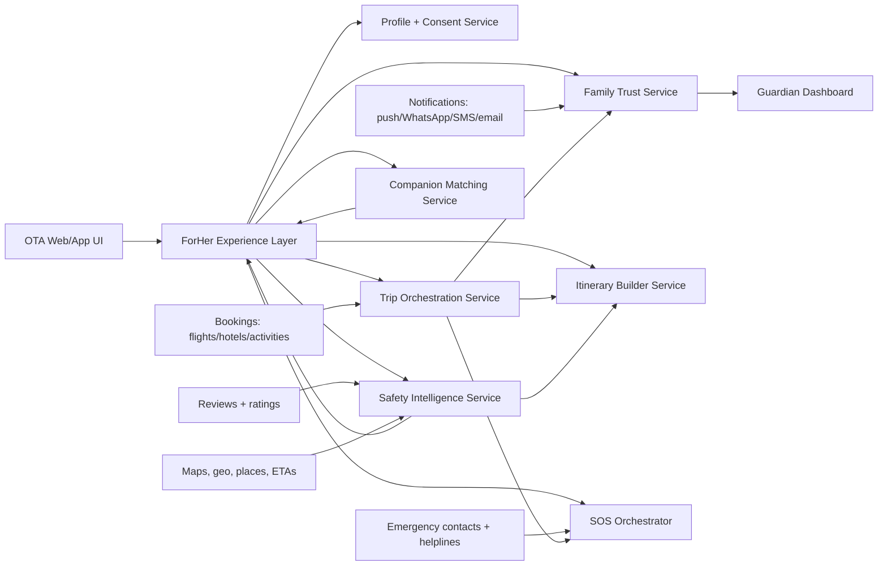

# ForHer Add-On Architecture And Rollout Plan

## 1. Product Intent

ForHer is an optional experience layer that sits on top of a standard travel booking flow on an OTA like MakeMyTrip. When the user turns on the `ForHer` toggle, the platform changes from a generic travel storefront into a safety-first assistant for women solo travellers.

The goal is not to create a separate booking business. The goal is to increase trust, trip conversion, and repeat usage by solving the hidden blockers that stop many women from travelling solo:

- family approval
- safety confidence before booking
- safer options during booking
- trusted companionship without forcing it
- low-friction check-ins during travel
- fast support in distress scenarios

## 2. Core Product Thesis

The strongest version of this idea is not "a women-themed UI." It is a decision-support and safety-assurance layer across the entire trip lifecycle.

That means ForHer should be built around three product principles:

1. Trust before aesthetics
The cute or relatable UI can exist, but it should be secondary to concrete safety outcomes.

2. Safety without extra effort
Users should not have to manually update family, repeatedly share screenshots, or rebuild their trip details.

3. Control and privacy by design
Every shared detail must be user-consented, time-bounded, and revocable.

## 3. User Segments

### Primary user
- Woman solo traveller booking flights, hotels, activities, or a bundled trip

### Secondary user
- Parent, sibling, partner, or guardian who needs reassurance but is not the main booker

### Tertiary user
- Other women solo travellers open to matching on partial trip overlap

## 4. End-To-End Journey

### Stage A: Intent and family approval
The user enables `ForHer` and sees a guided "Travel with confidence" entry point.

Key features:
- Family reassurance dashboard
- AI-written family safety brief
- Shareable trip card with hotel, transport, and emergency details
- Silent check-in automation

### Stage B: Safer discovery and booking
The user browses travel options with safety-aware ranking and filters.

Key features:
- Safety score on flights, hotels, and neighborhoods
- Risk-aware flight filtering
- Arrival-time warnings for late-night landings
- Recommended last-mile transport options for risky arrival windows

### Stage C: Optional companionship
The user can opt into matching with other women travellers with similar plans.

Key features:
- Match by hotel, flight, city, date overlap, or activity interests
- Temporary in-app chat
- Privacy-preserving profile exposure

### Stage D: Safe itinerary building
The user builds an itinerary optimized for daylight movement, safer zones, and reliable mobility.

Key features:
- Safe itinerary builder
- Venue and neighborhood trust overlays
- Recommended timings for activities and transfers

### Stage E: In-trip confidence and monitoring
The system runs in the background and reduces the need for manual coordination.

Key features:
- Automated check-in pings
- "Arrived safe" event notifications
- Trip state timeline for shared guardians
- Fallback support during missed check-ins

### Stage F: Emergency support and safe return
The platform helps in worst-case scenarios and reinforces trust for future use.

Key features:
- SOS flow
- Escalation tree
- Local emergency and helpline access
- End-of-trip "reached home" closure notification

## 5. Refined Feature Set

### 5.1 Family Trust Pack

This should be the signature differentiator.

Features:
- Live family dashboard
- AI-generated family safety brief in plain language
- One-tap share to WhatsApp or link
- Booking verification markers for flight and hotel
- Automated check-in events:
  - departed for airport
  - landed
  - checked into hotel
  - started return journey
  - reached home
- Configurable guardians and sharing permissions

Recommended refinement:
Do not expose live GPS by default. Expose status-based trip milestones first. Offer optional live location for limited windows only.

### 5.2 Safer Booking Layer

Features:
- Filter out poor-timing flights by default for solo women travel mode
- Highlight safer arrival windows
- Hotel safety score from women traveller reviews
- Nearby essentials:
  - pharmacy
  - police station
  - hospital
  - 24x7 convenience
- Last-mile transport suggestions for airport or station arrival

Recommended refinement:
Instead of hard-removing all odd-hour flights, use a ranking and explanation model:
- `Recommended`
- `Late arrival, use caution`
- `Not recommended for solo arrival`

This preserves choice while still nudging safer behavior.

### 5.3 Women Traveller Matchmaking

Features:
- Match on overlapping trip windows
- Match on same hotel or nearby hotel
- Match on common flight or airport arrival
- Match on selected activities
- Optional buddy circle for destination

Recommended refinement:
Do not launch with fully open chat. Start with:
- verified opt-in profiles
- limited-intent matching
- expiring conversation window
- report and block tooling

This reduces abuse risk.

### 5.4 Safe Itinerary Builder

Features:
- Day-count and destination-based itinerary generation
- Daylight-first planning
- Safer commute sequencing
- Venue closing-time and local transport awareness
- Women-reviewed places overlay

Recommended refinement:
Itinerary quality should optimize for:
- shorter risky transfers
- fewer late-night hops
- higher-rated neighborhoods
- reliable transit availability

### 5.5 Safety Score System

This should be visible across flights, hotels, neighborhoods, and activities.

Inputs:
- women traveller review sentiment
- arrival time risk
- neighborhood risk tags
- transport availability
- property verification quality
- incident reports or support signals

Display model:
- numeric score for scanning
- reason tags for trust
- explanation drill-down for advanced users

### 5.6 SOS and Escalation

Features:
- persistent SOS entry point
- emergency contact bundle
- quick-share live trip info
- local emergency numbers
- hotel front desk details
- one-tap escalation to chosen guardians

Recommended refinement:
Treat SOS as an orchestration system, not just a red button. It should:
- reveal exact support options by context
- trigger silent alert pathways
- capture current trip state
- show nearest trusted help options

### 5.7 UI Mode

The toggle can change tone and visuals, but it should mostly unlock new modules, badges, filters, and guidance. Cosmetic change alone is low value.

Recommended UI behavior:
- top-level `ForHer` toggle in discovery
- safety badges across listings
- family share CTA post-booking
- itinerary and SOS modules inside trip detail
- softer, relatable theme only when it does not hurt clarity

## 6. Suggested Product Modules

1. ForHer Toggle and Personalization
2. Family Trust Center
3. Safety Intelligence Engine
4. Safer Booking Filters
5. Women Match Network
6. Safe Itinerary Builder
7. In-Trip Check-In Automation
8. SOS and Escalation Console
9. Women Review and Safety Score Platform
10. Trust and Safety Admin Console

## 7. High-Level System Architecture

This should be implemented as an add-on platform layer integrated into the OTA rather than a separate app.

## 8. Service Breakdown

### 8.1 Profile and Consent Service

Responsibilities:
- store ForHer preferences
- manage guardian relationships
- store consent scopes
- manage emergency contacts
- manage share duration and revocation

Key design rule:
Every family-sharing action must be explicit, revocable, and auditable.

### 8.2 Trip Orchestration Service

Responsibilities:
- consume booking events from existing OTA systems
- normalize trip timeline
- emit domain events:
  - booking_confirmed
  - flight_departed
  - flight_landed
  - hotel_checked_in
  - return_started
  - trip_closed
- trigger downstream automation

This is the backbone of background safety workflows.

### 8.3 Family Trust Service

Responsibilities:
- generate family dashboard views
- render parent-oriented safety brief
- manage guardian notification subscriptions
- send WhatsApp, push, SMS, or email check-ins

Suggested design:
Use templates plus LLM summarization, not raw LLM freeform output. The model should summarize structured trip data into a parent-friendly brief.

### 8.4 Safety Intelligence Service

Responsibilities:
- compute safety score
- rank flight and hotel options
- annotate listings with risk tags
- assess arrival-time risk
- recommend safer transfer options

Core inputs:
- internal reviews
- geo metadata
- transport availability
- temporal risk rules
- property quality signals

### 8.5 Companion Matching Service

Responsibilities:
- opt-in discovery
- compatibility scoring
- hotel/date/activity overlap matching
- privacy-protected introductions
- moderation hooks

Suggested MVP:
Match suggestions only, then invite to connect. Avoid open search by default.

### 8.6 Itinerary Builder Service

Responsibilities:
- generate plan candidates
- score plans by safety and convenience
- sequence activities
- avoid bad transfer windows
- show rationale for itinerary choices

### 8.7 SOS Orchestrator

Responsibilities:
- context-aware escalation
- guardian alert workflows
- trip-state bundling
- location and hotel handoff
- support-agent routing if available

### 8.8 Trust and Safety Admin

Responsibilities:
- moderation queue
- incident review
- report handling
- fake profile prevention
- policy control for matching and sharing

## 9. Data Flow

### Booking to reassurance flow

1. User books a trip through the normal OTA flow
2. Booking event enters Trip Orchestration Service
3. ForHer layer detects eligible trip
4. User is prompted to activate trust pack
5. Guardian list and consent scope are configured
6. Family Trust Service generates dashboard and safety brief
7. Notifications are scheduled based on trip milestones

### During trip flow

1. Flight status or hotel confirmation events update trip timeline
2. Orchestration service emits event
3. Family Trust Service sends automatic reassurance update
4. If expected milestone is missed, fallback rule is triggered
5. User receives an in-app prompt first
6. If configured, guardian escalation follows

### Matching flow

1. User opts into matching
2. Matching service computes overlap candidates
3. Limited profile cards are shown
4. Mutual connect unlocks temporary chat or coordination room

## 10. Recommended Domain Model

Core entities:
- User
- ForHerPreference
- Guardian
- ConsentGrant
- Trip
- TripSegment
- Booking
- CheckInRule
- NotificationEvent
- SafetyScore
- WomenReview
- MatchProfile
- MatchCandidate
- ItineraryPlan
- SOSCase
- IncidentReport

Important relationships:
- one user can have many guardians
- one trip can have many segments
- one trip can have many safety events
- one user can opt into many match windows but only per-trip

## 11. API Surface

These are logical APIs, independent of implementation language.

### ForHer preferences
- `GET /forher/preferences`
- `PUT /forher/preferences`

### Guardians and consent
- `POST /forher/guardians`
- `GET /forher/guardians`
- `POST /forher/consents`
- `DELETE /forher/consents/{id}`

### Family trust pack
- `POST /forher/trips/{tripId}/share`
- `GET /forher/trips/{tripId}/family-dashboard`
- `POST /forher/trips/{tripId}/safety-brief`

### Safety scoring
- `GET /forher/listings/{listingId}/safety-score`
- `POST /forher/flight-options/rank`
- `POST /forher/hotel-options/rank`

### Matching
- `POST /forher/trips/{tripId}/matching/opt-in`
- `GET /forher/trips/{tripId}/matching/candidates`
- `POST /forher/matches/{matchId}/connect`

### Itinerary
- `POST /forher/itineraries/generate`
- `GET /forher/itineraries/{id}`

### SOS
- `POST /forher/sos/trigger`
- `GET /forher/sos/{caseId}`

## 12. Frontend Integration Strategy

For a platform like MMT, integration should happen at four surfaces:

### Surface 1: Discovery and search
- `ForHer` toggle near traveller filters
- safety-aware hotel and flight badges
- late-arrival warnings

### Surface 2: Listing and PDP
- safety score visible with explanation
- women-review highlights
- safe transfer hints

### Surface 3: Booking and checkout
- prompt to enable family trust pack
- guardian setup
- emergency contact setup

### Surface 4: Post-booking trip detail
- family dashboard controls
- itinerary builder
- match suggestions
- SOS entry

## 13. Privacy, Legal, And Safety Controls

This is a trust-sensitive feature set. These controls are non-negotiable.

- explicit consent before any sharing
- no always-on location sharing by default
- end-to-end audit logs for share events
- guardian invite acceptance flow
- rate limits and abuse checks on matching
- report, block, and moderation paths
- encrypted storage for contact and emergency data
- time-bounded links for family dashboards
- clear disclosure when AI-generated text is used

Important product guardrail:
Do not market the product as guaranteeing safety. Market it as improving preparedness, visibility, and response confidence.

## 14. MVP Scope

The MVP should focus on the lowest-risk and highest-trust pieces.

### MVP In
- ForHer toggle
- Family Trust Pack
- Parent-oriented AI safety brief
- Guardian dashboard with trip milestones
- Automated check-in notifications
- Safety score for hotels and flights using a limited rule engine
- Arrival-time warnings and safer transfer recommendations
- SOS screen with emergency contacts and trip-share bundle

### MVP Out
- full social matching marketplace
- live group chat
- real-time location tracking by default
- advanced community layers
- fully dynamic citywide risk model

## 15. Phase Plan

### Phase 0: Discovery and validation
Duration: 2 to 3 weeks

Goals:
- validate demand with women solo travellers and parents
- identify highest-trust moments in funnel
- test whether family dashboard improves conversion

Outputs:
- user interviews
- clickable prototype
- KPI hypothesis

### Phase 1: MVP build
Duration: 8 to 10 weeks

Build:
- ForHer toggle
- Family Trust Pack
- safety brief generation
- milestone notifications
- safety score v1
- SOS v1

Success criteria:
- higher ForHer booking conversion
- meaningful guardian share usage
- reduced drop-off after flight and hotel selection

### Phase 2: Safer planning
Duration: 4 to 6 weeks

Build:
- itinerary builder
- safer transit sequencing
- women review highlight layer

### Phase 3: Companion features
Duration: 6 to 8 weeks

Build:
- verified opt-in matchmaking
- limited interaction model
- moderation tooling

## 16. Suggested Engineering Architecture

### Frontend
- Web: React or Next.js add-on modules inside existing OTA surfaces
- Mobile: shared API contracts and modular feature flags

### Backend
- API gateway or BFF layer for ForHer UI
- event-driven services for trip milestones and notifications
- relational database for preferences, guardians, and trips
- search or feature-store support for ranking and matching if scale grows

### Async stack
- event bus or queue for booking and travel milestones
- scheduler for expected check-in windows
- notification worker for channel delivery and retries

### AI usage
- brief generation for guardians
- itinerary explanations
- support summarization

AI should not be the source of truth for trip status, risk facts, or emergency instructions.

## 17. Team Plan

Minimal squad:
- 1 product manager
- 1 designer
- 2 frontend engineers
- 2 backend engineers
- 1 data or ranking engineer
- 1 QA engineer
- trust and safety support from operations or policy

## 18. Metrics

Business metrics:
- activation rate of ForHer toggle
- booking conversion uplift for women solo travellers
- guardian share adoption
- repeat booking rate

Trust metrics:
- percentage of trips with completed trust pack
- notification success rate
- SOS response initiation rate
- false-positive escalation rate

Product metrics:
- itinerary builder usage
- safety score engagement
- safe transfer recommendation CTR
- match opt-in rate

## 19. Main Risks

### Risk 1: Overpromising safety
Mitigation:
- clear disclaimers
- confidence language instead of guarantees

### Risk 2: Privacy concerns from users
Mitigation:
- granular consent
- default-off sharing
- short-lived links

### Risk 3: Abuse in traveller matching
Mitigation:
- verified opt-in
- moderation
- limited exposure
- block and report tools

### Risk 4: Wrong or weak safety scoring
Mitigation:
- reason-tag transparency
- conservative labels
- human review on sensitive policy updates

## 20. Recommended Build Order

If this were implemented inside an existing OTA, the most pragmatic build order is:

1. ForHer toggle and feature flags
2. Trip orchestration and milestone events
3. Family Trust Pack
4. Safety score v1 on flights and hotels
5. SOS v1
6. Itinerary builder
7. Matchmaking

## 21. Final Recommendation

The most defensible version of ForHer is:

"A safety and trust layer for solo women travellers embedded inside a mainstream travel booking experience."

Do not lead with visual theming or community. Lead with trust:
- easier family approval
- safer booking choices
- lower in-trip friction
- stronger emergency confidence

That positioning is clearer, more valuable, and easier to launch in phases.

## 22. Open Product Questions

These should be resolved before detailed design:

1. Is ForHer meant only for solo travellers, or also women-only group travel?
2. Will guardians get web access, app access, or link-only access?
3. How much real-time location sharing is acceptable by default?
4. Will matching require identity verification?
5. Does the OTA have reliable event hooks for flight and hotel milestones?
6. What external providers will be used for WhatsApp and emergency workflows?
